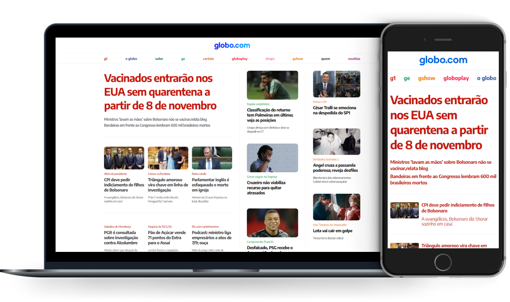

<h1 align="center">
  Globo.com
</h1>

  <a href="#-stack">Stack</a> | <a href="#-project">Project</a> | <a href="#-layout">Layout</a> | <a href="#-license">License</a>

  

<a href="https://felipehac.github.io/driven-globo.com/">

  

<strong>LIVE DEMO</strong>

</a>

## 🚀 Stack

This project was developed with the following stack:

- HTML
- CSS

## 💻 Project

The project was developed as a way to consolidate the knowledge obtained during the first week of Driven's bootcamp.

It is a simple, static yet responsive page built with HTML and CSS to serve as a clone of the globo.com website.

## 🔖 Layout

You can view the project layout through [this link](https://www.figma.com/file/pSvuucQNOEXnJ5s53PgHC9/Driven-%2F-Projects-%2F-O-Globo?node-id=0%3A1). You need an account on [Figma](https://figma.com) to access it.

## 📝 License

This project is under the MIT license. See the file [LICENSE](LICENSE.md) for more details.

---
